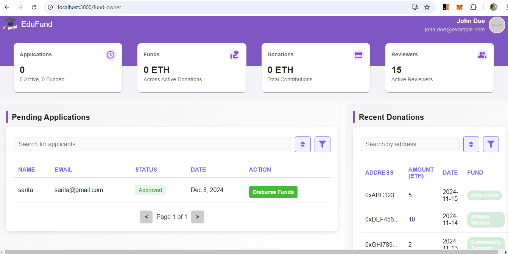

Scholarship Fund DApp
====================

A decentralized application for managing scholarship funds using blockchain. This project facilitates secure and transparent processes for applicants, donors, and reviewers.


Team
-------
Sarita Joshi\
saritajoshi@csu.fullerton.edu\
Sarita-Joshi (@git)

Feel free to reach out for support or feedback!

4o

Features
--------

-   **Applicants**:
    -   Apply for scholarships.
    -   Check the status of applications.
-   **Donors**:
    -   Create and contribute to funds.
    -   Track contributions.
-   **Reviewers**:
    -   Approve or reject applications.
    -   Ensure fair and transparent decision-making.
    **Admin**:
    -   Admin module to monitor and disubrse funds.


* * * * *

Project Setup
-------------

### Prerequisites

Ensure the following tools are installed on your system:

-   **Node.js** (version 14 or higher): Install from the official Node.js website.
-   **Truffle**: Install globally using `npm install -g truffle`.
-   **MongoDB**: Install MongoDB locally or use a cloud database such as MongoDB Atlas.
-   **Ganache**: Download and install Ganache for local blockchain development.
-   **MetaMask**: Add MetaMask as a browser extension and configure it for local development.

* * * * *

### Step 1: Clone the Repository

Clone the project repository and navigate to the project directory.

```
git clone https://github.com/Sarita-Joshi/Decentralized-Scholarship-Fund.git
```

* * * * *

### Step 2: Backend Setup

1.  Navigate to the backend directory `cd backend`.
2.  Install the backend dependencies using `npm install`.
3.  Create a .env file in the backend directory with the following content:
    -   Mongo_URI - connection string of mongodb instance.
    -   PORT - port number.
4.  Optionally, run seedData.js to populate the database or blockchain with initial test data.
5.  Start the backend server by running `node server.js`.


#### MongoDB Setup

1.  **Local MongoDB**:

    -   Install MongoDB from the [official website](https://www.mongodb.com/try/download/community).
    -   Start the MongoDB server on your local machine:
        -   Default port: 27017.
    -   Use the connection string: `mongodb://localhost:27017/scholarshipFund`.
2.  **MongoDB Atlas** (Cloud Database):

    -   Sign up at [MongoDB Atlas](https://www.mongodb.com/cloud/atlas).
    -   Create a new cluster and database.
    -   Obtain the connection string and add it to your `.env` file under `MONGODB_URI`.
    -   Example connection string: `mongodb+srv://<username>:<password>@cluster0.mongodb.net/scholarshipFund?retryWrites=true&w=majority`.
3.  Verify that the backend connects to MongoDB successfully by checking the logs in the terminal when running `server.js`.


* * * * *

### Step 3: Smart Contract Setup

1.  Compile the smart contracts by running `truffle compile`.
2.  Deploy the smart contracts by running `truffle migrate --network development`.
3.  Verify that the contract is deployed successfully. Copy the deployed contract address to use in the .env files for both the frontend and backend.

* * * * *

### Step 4: Frontend Setup

1.  Navigate to the frontend directory `cd frontend`.
2.  Install the frontend dependencies using `npm install`.
3.  Copy the json file in `build/contract/ScholarshipFund.json` to contracts folder in `frontend/src/contracts/ScholarshipFund.json`. This is essential to get latest contract address, ABI.
4.  Start the React app using `npm start`. The app will open in your default browser.

* * * * *

### Step 5: Testing

#### Unit Testing with Truffle

1.  Test file is in test/ScholarshipFund.test.js.
2.  Run the tests using `truffle test`.


#### App Journey

1.  Open the application in your browser.
2.  Connect MetaMask to the local blockchain (Ganache).
3.  Test features such as creating funds, applying for scholarships, donating funds, and reviewing applications.




-------------------
Directory Structure

scholarship-fund-dapp/

-   backend/: Backend server
    -   .env: Environment variables
    -   package.json: Backend dependencies
    -   server.js: Backend server file
    -   seedData.js: Script to seed initial data
-   build/contracts/: Compiled contracts
-   contracts/: Solidity smart contracts
-   frontend/: React frontend
    -   .env: Frontend environment variables
    -   public/: Static files
    -   src/: React components
    -   package.json: Frontend dependencies
-   migrations/: Deployment scripts
-   test/: Smart contract tests
-   truffle-config.js: Truffle configuration
-   README.md: Project documentation

----------------
Technology Stack


-   **Frontend**: React, Ethers.js
-   **Backend**: Node.js, Solidity
-   **Blockchain**: Ethereum, Truffle, Ganache
-   **Wallet**: MetaMask


